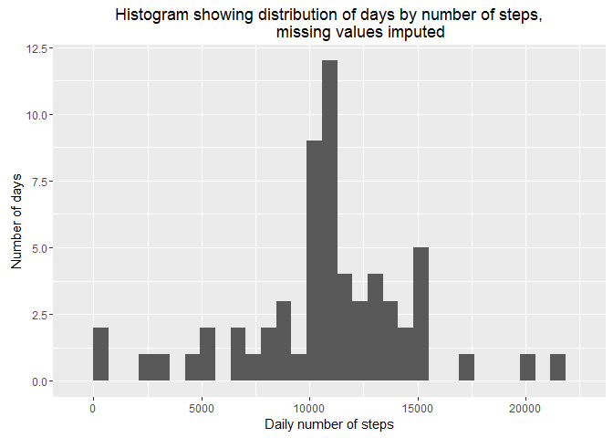
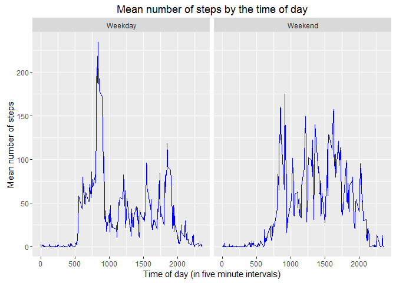

Title: "Reproducible Research: Peer Assessment 1"
=================================================


## Loading and preprocessing the data

We will load the dataset using the following code:


```r
unzip("activity.zip")
activity <- read.csv("activity.csv",na.strings = "NA")
activity$date <- as.Date(activity$date)

# Make a pretty label for the time
library(stringr)
activity$interval.label <- str_pad(as.character(activity$interval),
                                   width=4,
                                   side="left",
                                   pad="0")
activity$interval.label <- paste(substr(activity$interval.label,1,2),
                                 substr(activity$interval.label,3,4),
                                        sep=":")
```


## What is mean total number of steps taken per day?

We can easily find the mean total number of steps per day using the dplyr 
package. The R-code below summarises the data and presents it as a histogram:


```r
library(dplyr) #loading dplyr in order to summarise data easily
```

```
## 
## Attaching package: 'dplyr'
## 
## The following objects are masked from 'package:stats':
## 
##     filter, lag
## 
## The following objects are masked from 'package:base':
## 
##     intersect, setdiff, setequal, union
```

```r
library(ggplot2) #loading ggplot2 to make plots
```

```
## Warning: package 'ggplot2' was built under R version 3.2.3
```

```r
# Calculating daily number of steps for each day:
steps.daily <- summarise(group_by(activity,date),steps = sum(steps))

# Plotting a histogram
ggplot(data=steps.daily,aes(steps.daily$steps)) +
      geom_histogram() +
      ylab("Number of days") +
      xlab("Daily number of steps") +
      ggtitle("Histogram showing distribution of days by number of steps")
```

```
## `stat_bin()` using `bins = 30`. Pick better value with `binwidth`.
```

```
## Warning: Removed 8 rows containing non-finite values (stat_bin).
```

 

Furthermore we can calculate the mean and median number of steps per day
using the following code:


```r
steps.mean <- mean(steps.daily$steps,na.rm = TRUE)
steps.mean # print mean number of steps
```

```
## [1] 10766.19
```

```r
steps.median <- median(steps.daily$steps,na.rm=TRUE)
steps.median # print median number of steps
```

```
## [1] 10765
```


## What is the average daily activity pattern?

First we summarise steps per five-minute period:


```r
steps.intervals <- summarise(group_by(activity,interval),
                             steps = mean(steps,na.rm =TRUE))
```

Then we plot the steps:


```r
ggplot(data=steps.intervals,aes(x=steps.intervals$interval, 
                                y=steps.intervals$steps)) +
      geom_line(colour="blue") +
      ylab("Mean number of steps") +
      xlab("Time of day (in five minute intervals)") +
      ggtitle("Mean number of steps by the time of day")
```

 

The time-of-day interval with the highest number of mean steps is found using 
the following code:


```r
steps.intervals[steps.intervals$steps == max(steps.intervals$steps),]
```

```
## Source: local data frame [1 x 2]
## 
##   interval    steps
##      (int)    (dbl)
## 1      835 206.1698
```

In other words, the highest mean activity was between 08:35 and 08:40 in the 
morning.

## Imputing missing values

First, we will count the total number of missing values:


```r
# Total number of missing values
sum(is.na(activity$steps))
```

```
## [1] 2304
```

```r
# Fraction of observations that are missing values (for reference):
sum(is.na(activity$steps)) / nrow(activity)
```

```
## [1] 0.1311475
```

In total about 13 % of the dataset contain missing values.

Missing values may introduce bias into the estimates. Simple ways of doing this
is to replace missing values with the mean per day or the mean per five-minute
interval.

It is instructive to calculate standard deviations for these two groups (while
transforming for the various dimensions):


```r
# Standard deviation for five minute intervals, transformed to daily totals
sd(steps.intervals$steps* 24 * 60 / 5)
```

```
## [1] 11135.33
```

```r
# Standard deviation for daily sums, removing missing days
sd(steps.daily$steps,na.rm=TRUE)
```

```
## [1] 4269.18
```

The standard deviation of the (adjusted) five minute intervals is larger than 
the standard deviation of the daily totals by a factor of 2.6, even though the
variability of the daily totals increases (perhaps significantly) by days with
partial missing values. For the most accurate results then, it is clear that we 
should replace missing values with the mean activity in each particular five-
minute interval. 

This is done using the following code:


```r
activity.temp <- left_join(activity,steps.intervals,by = "interval")
activity2 <- activity
for (i in 1:nrow(activity)) {
      if (is.na(activity$steps[i])) {
            activity2$steps[i] <- activity.temp$steps.y[i]
      } else {
            activity2$steps[i] <- activity.temp$steps.x[i]
      }
      
}
```

Next, we will build a histogram for the imputed dataset:


```r
# Calculating daily number of steps for each day:
steps.daily2 <- summarise(group_by(activity2,date),steps = sum(steps))

# Plotting a histogram
ggplot(data=steps.daily2,aes(steps.daily2$steps)) +
      geom_histogram() +
      ylab("Number of days") +
      xlab("Daily number of steps") +
      ggtitle("Histogram showing distribution of days by number of steps,
              missing values imputed")
```

```
## `stat_bin()` using `bins = 30`. Pick better value with `binwidth`.
```

 

We then calculate mean and median scores for this distribution:


```r
steps2.mean <- mean(steps.daily2$steps)
steps2.mean # print mean number of steps
```

```
## [1] 10766.19
```

```r
steps2.median <- median(steps.daily2$steps)
steps2.median # print median number of steps
```

```
## [1] 10766.19
```

The imputation had no discernible effect on the mean number of daily steps. 
The median number of daily steps increased by 1.19, which is insignificant.


## Are there differences in activity patterns between weekdays and weekends?

In order to examine differences between weekdays and weekend, we create a new
factor variable called weekend:


```r
activity$weekend <- factor( weekdays(activity$date,abbreviate = TRUE) %in% c("Sat","Sun"),
                            labels=c("Weekday","Weekend"))
```

The plot below allows us to compare activity during weekdays and weekends:


```r
steps.weekend <- summarise(group_by(activity,interval,weekend),
                             steps = mean(steps,na.rm =TRUE))
ggplot(data=steps.weekend,aes(x=interval, 
                                y=steps)) +
      facet_wrap(~weekend,nrow=1) +
      geom_line(colour="blue") +
      ylab("Mean number of steps") +
      xlab("Time of day (in five minute intervals)") +
      ggtitle("Mean number of steps by the time of day")
```

 

As we can see, there are in fact intriguing differences between weekday and
weekend activity patterns. We see that the 08:35 activity spike is a distinctive
weekday phenomenon. Weekend activities tend to be skewed later in the day compared
to weekday activities. While the highest mean intensity occurs during the weekdays,
the highest overall activity appears to occur in the weekend. We can confirm this
by checking the mean daily number of steps for weekends versus weekdays:


```r
steps.daily2$weekend <- factor( weekdays(steps.daily2$date,abbreviate = TRUE) %in% c("Sat","Sun"),
                                labels=c("Weekday","Weekend"))
dailymean2 <- summarise(group_by(steps.daily2,weekend),steps = mean(steps))
dailymean2
```

```
## Source: local data frame [2 x 2]
## 
##   weekend    steps
##    (fctr)    (dbl)
## 1 Weekday 10255.85
## 2 Weekend 12201.52
```
